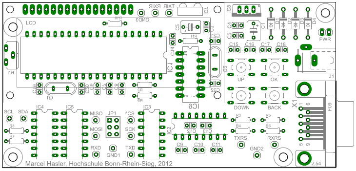
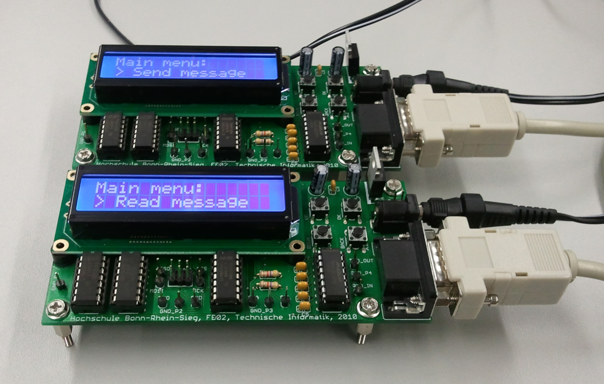

# ePro: Secret Messages

## Introduction
ePro (short for entry-level project) was a series of introduction courses offered by Bonn-Rhein-Sieg University of Applied Sciences starting in 2010.

One of these courses, named "Secret Messages", aimed to give first-semester students a practical introduction to the field of data transmission, from the most low-level concepts, such as logical voltage levels, over bus systems like UART, SPI and I²C up to higher-level concepts, such as protocol stacks and data encryption.

This repository contains schematics, PCB layout and firmware for a circuit board originally developed during an internship project in the summer of 2010 to support this course beginning later that year. These devices, based on an ATmega32 microcontroller, can communicate over any of the three aforementioned interfaces and exchange messages using a very simple encryption scheme. All signals are exposed via pin headers for analysis by means of oscilloscope and/or bus sniffer.

  

The message to be transmitted can be selected from a built-in database of famous quotations through a pin-protected administration menu where also the encryption key can be set. The goal of the project was for every team to analyze the data transmitted over the chosen interface, decipher the message and document their findings along the way.

Unfortunately the ePro courses were canceled with the introduction of a new curriculum some years ago. This repository is provided in the hope that the circuit boards developed back in 2010 might still find some use in similar academic projects in the future.

  

## License
The source code for the firmware is licensed under the terms of the GNU General Public License (GPL). The schematics and layout files are licensed under the terms of the Creative Commons Attribution-ShareAlike International Public License (CC BY-SA). See COPYING in the respective subdirectories for details.
